:::{#images}
<figure>[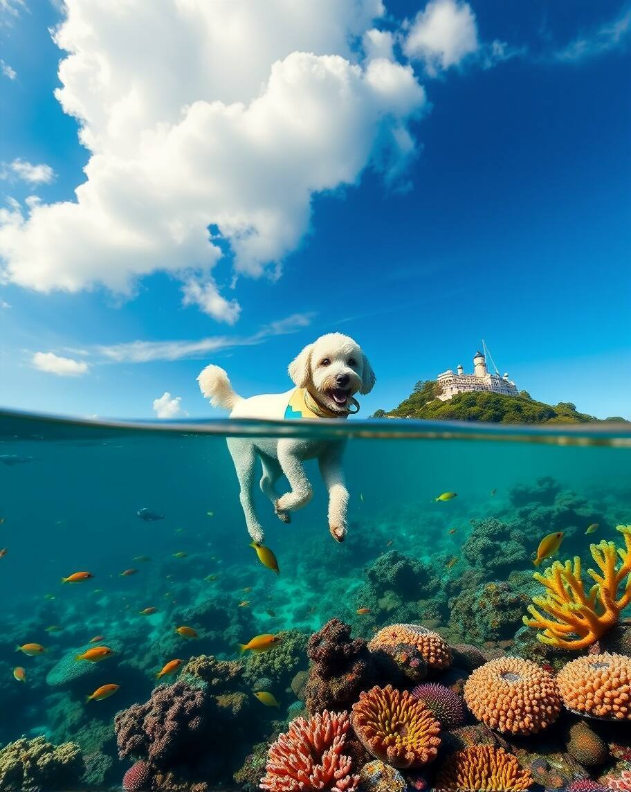{width=600px}](cassie-sloop-01.jpg)<figcaption>cassie-sloop-01.jpg Create an image of a white Spoodle dog wearing sou'wester sailing a sloop past an island in the South Sulu Sea. The image is part above-water and part below-water. Below water teems a myriad of life - fishes, sea mammals, softa dn hard coral, sponges, anemones in a great variety of colors and textures. The sky is blue with a large cumulonimbus cloud. The image is in the style of a photograph...Starry-ai
</figcaption></figure>
<figure>[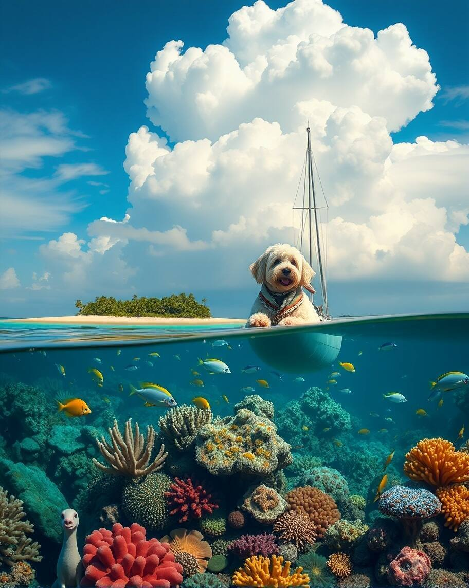{width=600px}](cassie-sloop-02.jpg)<figcaption>cassie-sloop-02.jpg Create an image of a white Spoodle dog wearing sou'wester sailing a sloop past an island in the South Sulu Sea. The image is part above-water and part below-water. Below water teems a myriad of life - fishes, sea mammals, softa dn hard coral, sponges, anemones in a great variety of colors and textures. The sky is blue with a large cumulonimbus cloud. The image is in the style of a photograph...Starry-ai
</figcaption></figure>
<figure>[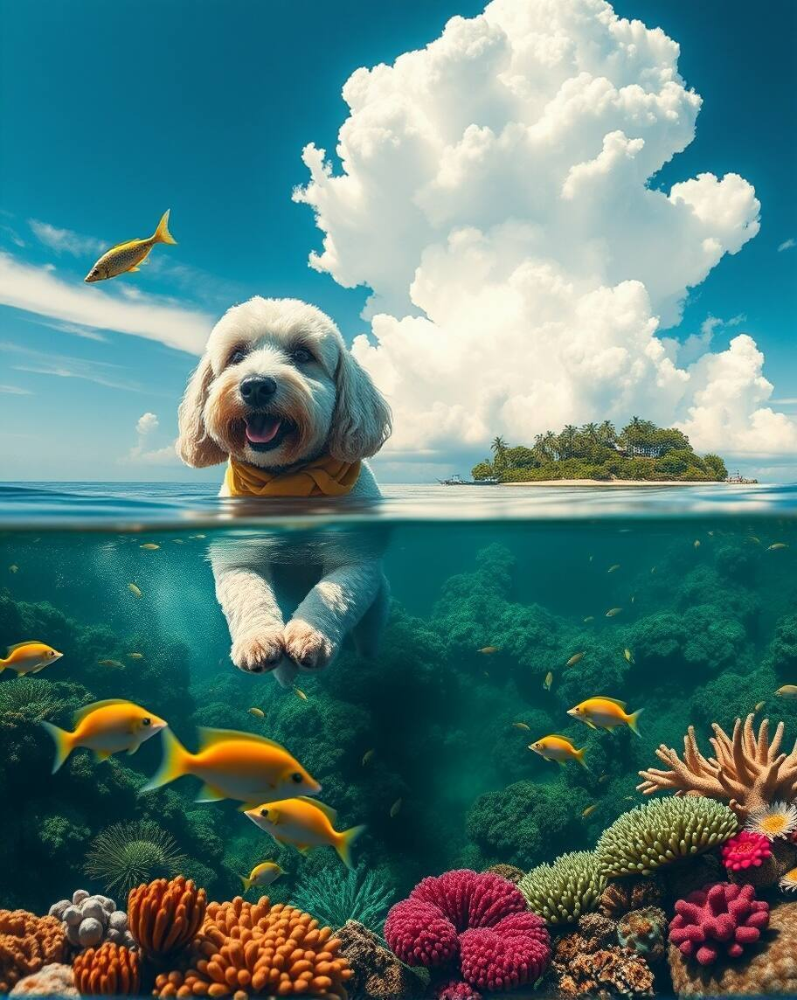{width=600px}](cassie-sloop-03.jpg)<figcaption>cassie-sloop-03.jpg Create an image of a white Spoodle dog wearing sou'wester sailing a sloop past an island in the South Sulu Sea. The image is part above-water and part below-water. Below water teems a myriad of life - fishes, sea mammals, softa dn hard coral, sponges, anemones in a great variety of colors and textures. The sky is blue with a large cumulonimbus cloud. The image is in the style of a photograph...Starry-ai
</figcaption></figure>
<figure>[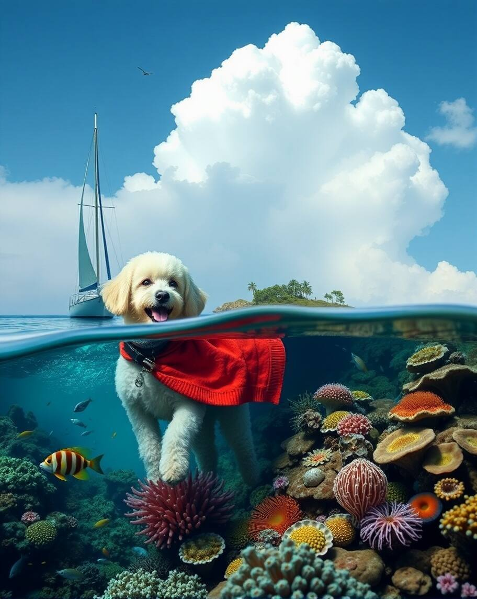{width=600px}](cassie-sloop-04.jpg)<figcaption>cassie-sloop-04.jpg Create an image of a white Spoodle dog wearing sou'wester sailing a sloop past an island in the South Sulu Sea. The image is part above-water and part below-water. Below water teems a myriad of life - fishes, sea mammals, softa dn hard coral, sponges, anemones in a great variety of colors and textures. The sky is blue with a large cumulonimbus cloud. The image is in the style of a photograph...Starry-ai
</figcaption></figure>
<figure>[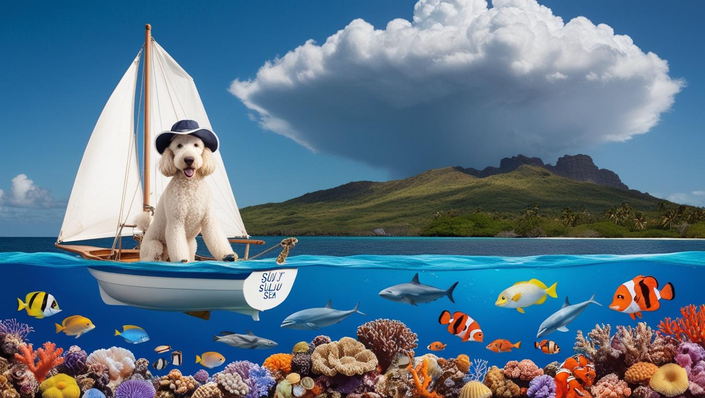{width=600px}](cassie-sloop-05.jpg)<figcaption>cassie-sloop-05.jpg Create an image of a white Spoodle dog wearing sou'wester sailing a sloop past an island in the South Sulu Sea. The image is part above-water and part below-water. Below water teems a myriad of life - fishes, sea mammals, softa dn hard coral, sponges, anemones in a great variety of colors and textures. The sky is blue with a large cumulonimbus cloud. The image is in the style of a photograph...Canva.
</figcaption></figure>
<figure>[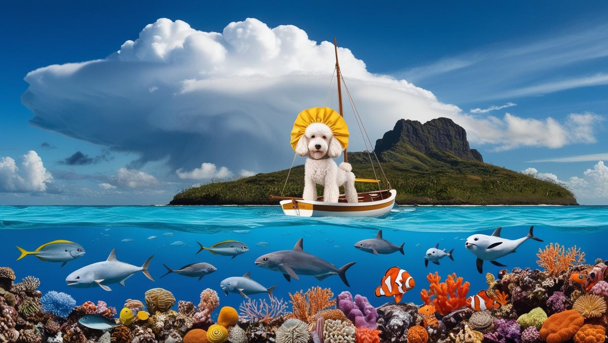{width=600px}](cassie-sloop-06.jpg)<figcaption>cassie-sloop-06.jpg Create an image of a white Spoodle dog wearing sou'wester sailing a sloop past an island in the South Sulu Sea. The image is part above-water and part below-water. Below water teems a myriad of life - fishes, sea mammals, softa dn hard coral, sponges, anemones in a great variety of colors and textures. The sky is blue with a large cumulonimbus cloud. The image is in the style of a photograph...Canva.
</figcaption></figure>
<figure>[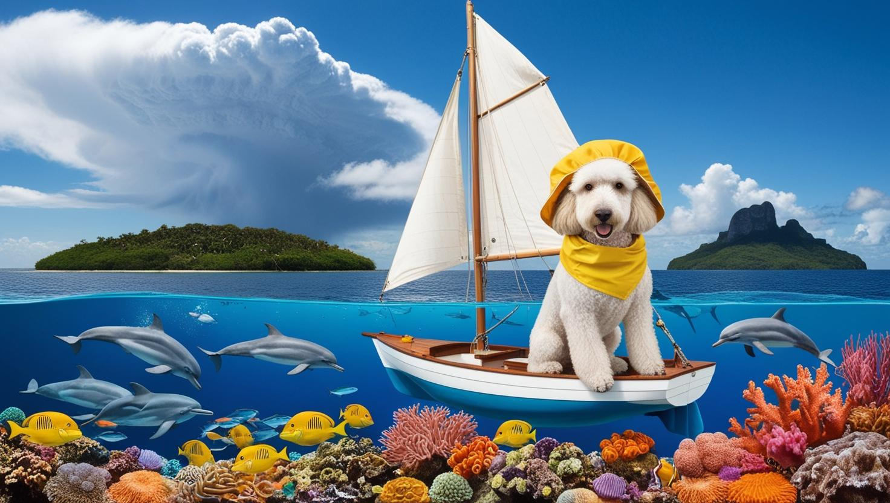{width=600px}](cassie-sloop-07.jpg)<figcaption>cassie-sloop-07.jpg Create an image of a white Spoodle dog wearing sou'wester sailing a sloop past an island in the South Sulu Sea. The image is part above-water and part below-water. Below water teems a myriad of life - fishes, sea mammals, softa dn hard coral, sponges, anemones in a great variety of colors and textures. The sky is blue with a large cumulonimbus cloud. The image is in the style of a photograph...Canva.
</figcaption></figure>
<figure>[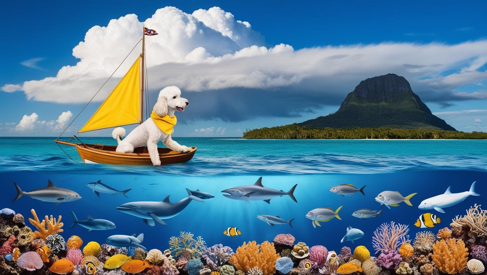{width=600px}](cassie-sloop-08.jpg)<figcaption>cassie-sloop-08.jpg Create an image of a white Spoodle dog wearing sou'wester sailing a sloop past an island in the South Sulu Sea. The image is part above-water and part below-water. Below water teems a myriad of life - fishes, sea mammals, softa dn hard coral, sponges, anemones in a great variety of colors and textures. The sky is blue with a large cumulonimbus cloud. The image is in the style of a photograph...Canva.
</figcaption></figure>
<figure>[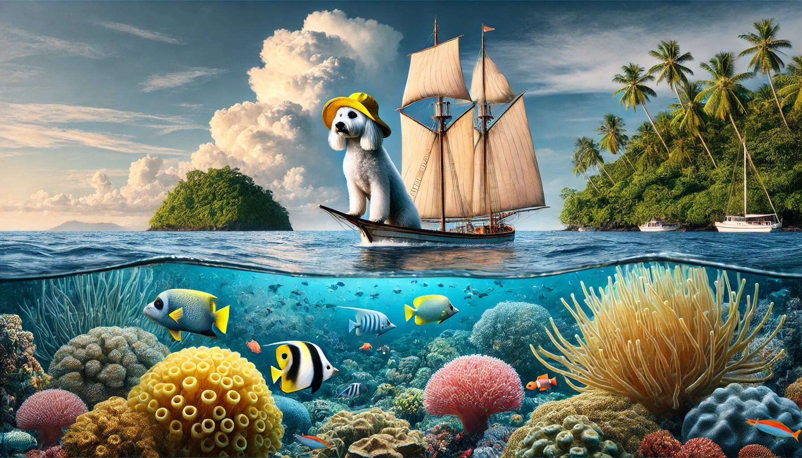{width=600px}](cassie-sloop-09.jpg)<figcaption>cassie-sloop-09.jpg Create an image of a white Spoodle dog wearing sou'wester sailing a sloop past an island in the South Sulu Sea. The image is part above-water and part below-water. Below water teems a myriad of life - fishes, sea mammals, softa dn hard coral, sponges, anemones in a great variety of colors and textures. The sky is blue with a large cumulonimbus cloud. The image is in the style of a photograph...Dalle-e
</figcaption></figure>
<figure>[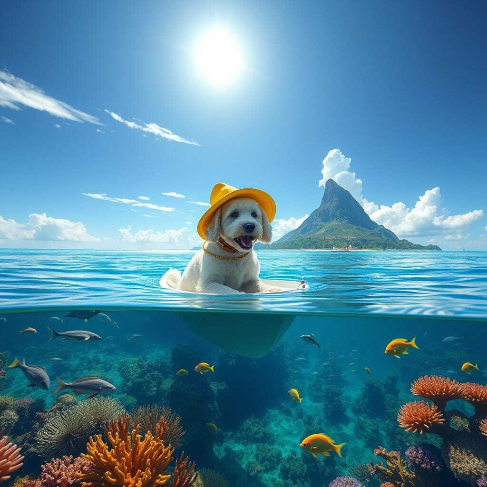{width=600px}](cassie-sloop-10.jpg)<figcaption>cassie-sloop-10.jpg Create an image of a white Spoodle dog wearing sou'wester sailing a sloop past an island in the South Sulu Sea. The image is part above-water and part below-water. Below water teems a myriad of life - fishes, sea mammals, softa dn hard coral, sponges, anemones in a great variety of colors and textures. The sky is blue with a large cumulonimbus cloud. The image is in the style of a photograph...Nightcafe.
</figcaption></figure>
<figure>[{width=600px}](cassie-sloop-11.jpg)<figcaption>cassie-sloop-11.jpg Create an image of a white Spoodle dog wearing sou'wester sailing a sloop past an island in the South Sulu Sea. The image is part above-water and part below-water. Below water teems a myriad of life - fishes, sea mammals, softa dn hard coral, sponges, anemones in a great variety of colors and textures. The sky is blue with a large cumulonimbus cloud. The image is in the style of a photograph...Deep-ai
</figcaption></figure>
<figure>[{width=600px}](cassie-sloop-12.jpg)<figcaption>cassie-sloop-12.jpg Create an image of a white Spoodle dog wearing sou'wester sailing a sloop past an island in the South Sulu Sea. The image is part above-water and part below-water. Below water teems a myriad of life - fishes, sea mammals, softa dn hard coral, sponges, anemones in a great variety of colors and textures. The sky is blue with a large cumulonimbus cloud. The image is in the style of a photograph...Gemini.
</figcaption></figure>
<figure>[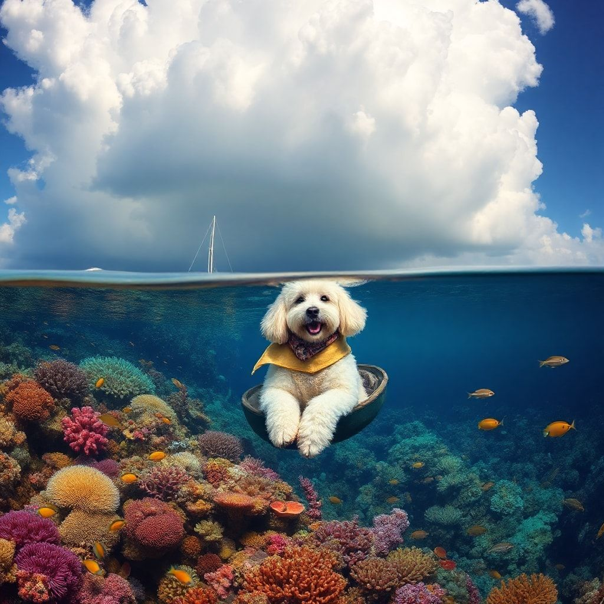{width=600px}](cassie-sloop-13.jpg)<figcaption>cassie-sloop-13.jpg Create an image of a white Spoodle dog wearing sou'wester sailing a sloop past an island in the South Sulu Sea. The image is part above-water and part below-water. Below water teems a myriad of life - fishes, sea mammals, softa dn hard coral, sponges, anemones in a great variety of colors and textures. The sky is blue with a large cumulonimbus cloud. The image is in the style of a photograph...Stable difffusion.
</figcaption></figure>
:::
:::{#prompt}
:::

