:::{#images}
<figure>[{width=600px}](cassie-snorkle-01.jpg)<figcaption>cassie-snorkle-01.jpg Create a detailed image of an underwater world including corals, a multitude of sea creatures, and rocky outcrops and caves.  Include: Clownfish Parrotfish Butterflyfish Angelfish Moray Eel Sea Turtles Stingrays Sea Anemones Starfish Sea Urchins Lionfish Barracuda Surgeonfish Giant Clams Sea Cucumbers Octopus Reef Sharks Manta Rays Seahorses and Coral Polyps.  In the foreground is a white Spoodle dog wearing a mask and snorkle free diving mid-water. Rays of light penetrate the water. The image is in the style of a photograph, with incredible detail and a multitude of sea creatures swimming, floating and crawling...Starry AI
</figcaption></figure>
<figure>[{width=600px}](cassie-snorkle-02.jpg)<figcaption>cassie-snorkle-02.jpg Create a detailed image of an underwater world including corals, a multitude of sea creatures, and rocky outcrops and caves.  Include: Clownfish Parrotfish Butterflyfish Angelfish Moray Eel Sea Turtles Stingrays Sea Anemones Starfish Sea Urchins Lionfish Barracuda Surgeonfish Giant Clams Sea Cucumbers Octopus Reef Sharks Manta Rays Seahorses and Coral Polyps.  In the foreground is a white Spoodle dog wearing a mask and snorkle free diving mid-water. Rays of light penetrate the water. The image is in the style of a photograph, with incredible detail and a multitude of sea creatures swimming, floating and crawling...Starry AI
</figcaption></figure>
<figure>[{width=600px}](cassie-snorkle-03.jpg)<figcaption>cassie-snorkle-03.jpg Create a detailed image of an underwater world including corals, a multitude of sea creatures, and rocky outcrops and caves.  Include: Clownfish Parrotfish Butterflyfish Angelfish Moray Eel Sea Turtles Stingrays Sea Anemones Starfish Sea Urchins Lionfish Barracuda Surgeonfish Giant Clams Sea Cucumbers Octopus Reef Sharks Manta Rays Seahorses and Coral Polyps.  In the foreground is a white Spoodle dog wearing a mask and snorkle free diving mid-water. Rays of light penetrate the water. The image is in the style of a photograph, with incredible detail and a multitude of sea creatures swimming, floating and crawling...Starry AI
</figcaption></figure>
<figure>[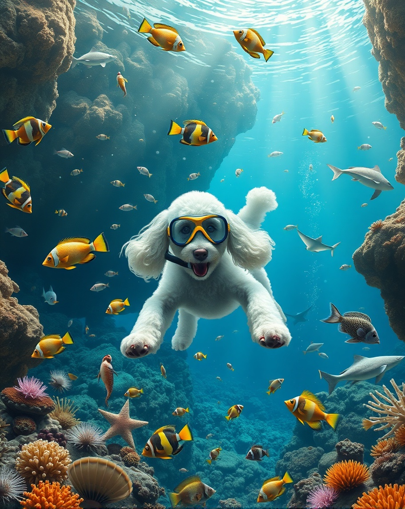{width=600px}](cassie-snorkle-04.jpg)<figcaption>cassie-snorkle-04.jpg Create a detailed image of an underwater world including corals, a multitude of sea creatures, and rocky outcrops and caves.  Include: Clownfish Parrotfish Butterflyfish Angelfish Moray Eel Sea Turtles Stingrays Sea Anemones Starfish Sea Urchins Lionfish Barracuda Surgeonfish Giant Clams Sea Cucumbers Octopus Reef Sharks Manta Rays Seahorses and Coral Polyps.  In the foreground is a white Spoodle dog wearing a mask and snorkle free diving mid-water. Rays of light penetrate the water. The image is in the style of a photograph, with incredible detail and a multitude of sea creatures swimming, floating and crawling...Starry AI
</figcaption></figure>
<figure>[{width=600px}](cassie-snorkle-05.jpg)<figcaption>cassie-snorkle-05.jpg Create a detailed image of an underwater world including corals, a multitude of sea creatures, and rocky outcrops and caves. In the foreground is a white Spoodle dog wearing a mask and snorkle free diving mid-water. Rays of light penetrate the water. The image is in the style of a photograph, with incredible detail and a multitude of sea creatures swimming, floating and crawling...Dalle-e.
</figcaption></figure>
<figure>[{width=600px}](cassie-snorkle-06.jpg)<figcaption>cassie-snorkle-06.jpg Create a detailed image of an underwater world including corals, a multitude of sea creatures, and rocky outcrops and caves.  Include: Clownfish Parrotfish Butterflyfish Angelfish Moray Eel Sea Turtles Stingrays Sea Anemones Starfish Sea Urchins Lionfish Barracuda Surgeonfish Giant Clams Sea Cucumbers Octopus Reef Sharks Manta Rays Seahorses and Coral Polyps.  In the foreground is a white Spoodle dog wearing a mask and snorkle free diving mid-water. Rays of light penetrate the water. The image is in the style of a photograph, with incredible detail and a multitude of sea creatures swimming, floating and crawling...Dalle-e.
</figcaption></figure>
<figure>[{width=600px}](cassie-snorkle-07.jpg)<figcaption>cassie-snorkle-07.jpg Create a detailed image of an underwater world including corals, a multitude of sea creatures, and rocky outcrops and caves.  Include: Clownfish Parrotfish Butterflyfish Angelfish Moray Eel Sea Turtles Stingrays Sea Anemones Starfish Sea Urchins Lionfish Barracuda Surgeonfish Giant Clams Sea Cucumbers Octopus Reef Sharks Manta Rays Seahorses and Coral Polyps.  In the foreground is a white Spoodle dog wearing a mask and snorkle free diving mid-water. Rays of light penetrate the water. The image is in the style of a photograph, with incredible detail and a multitude of sea creatures swimming, floating and crawling...Deep AI.
</figcaption></figure>
<figure>[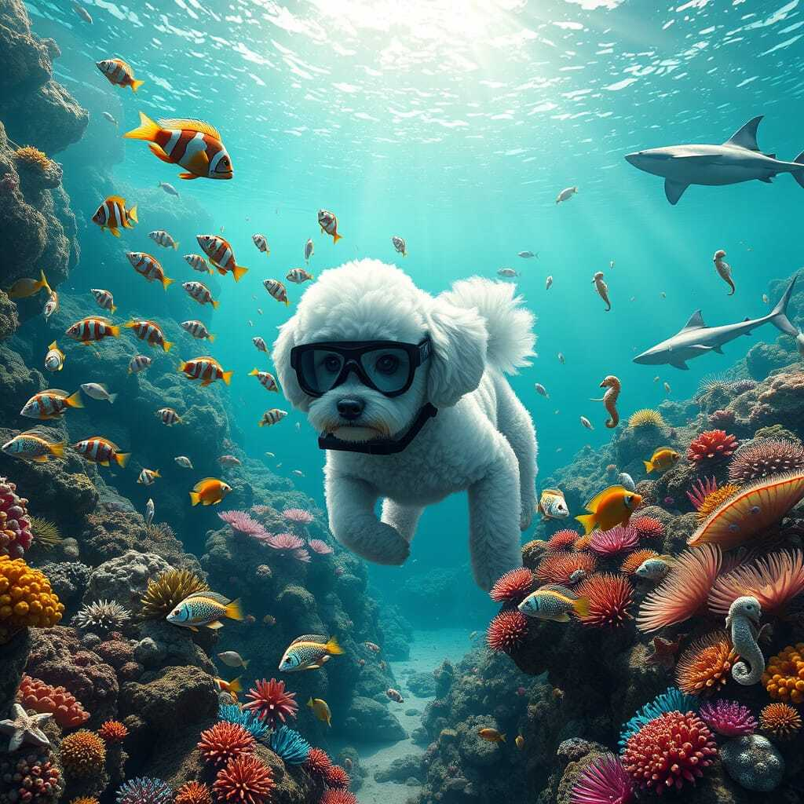{width=600px}](cassie-snorkle-08.jpg)<figcaption>cassie-snorkle-08.jpg Create a detailed image of an underwater world including corals, a multitude of sea creatures, and rocky outcrops and caves.  Include: Clownfish Parrotfish Butterflyfish Angelfish Moray Eel Sea Turtles Stingrays Sea Anemones Starfish Sea Urchins Lionfish Barracuda Surgeonfish Giant Clams Sea Cucumbers Octopus Reef Sharks Manta Rays Seahorses and Coral Polyps.  In the foreground is a white Spoodle dog wearing a mask and snorkle free diving mid-water. Rays of light penetrate the water. The image is in the style of a photograph, with incredible detail and a multitude of sea creatures swimming, floating and crawling...NightCafe.
</figcaption></figure>
<figure>[{width=600px}](cassie-snorkle-09.jpg)<figcaption>cassie-snorkle-09.jpg Create a detailed image of an underwater world including corals, a multitude of sea creatures, and rocky outcrops and caves.  Include: Clownfish Parrotfish Butterflyfish Angelfish Moray Eel Sea Turtles Stingrays Sea Anemones Starfish Sea Urchins Lionfish Barracuda Surgeonfish Giant Clams Sea Cucumbers Octopus Reef Sharks Manta Rays Seahorses and Coral Polyps.  In the foreground is a white Spoodle dog wearing a mask and snorkle free diving mid-water. Rays of light penetrate the water. The image is in the style of a photograph, with incredible detail and a multitude of sea creatures swimming, floating and crawling...Gemini.
</figcaption></figure>
<figure>[{width=600px}](cassie-snorkle-10.jpg)<figcaption>cassie-snorkle-10.jpg Create a detailed image of an underwater world including corals, a multitude of sea creatures, and rocky outcrops and caves.  Include: Clownfish Parrotfish Butterflyfish Angelfish Moray Eel Sea Turtles Stingrays Sea Anemones Starfish Sea Urchins Lionfish Barracuda Surgeonfish Giant Clams Sea Cucumbers Octopus Reef Sharks Manta Rays Seahorses and Coral Polyps.  In the foreground is a white Spoodle dog wearing a mask and snorkle free diving mid-water. Rays of light penetrate the water. The image is in the style of a photograph, with incredible detail and a multitude of sea creatures swimming, floating and crawling...Stable Difffusion.
</figcaption></figure>
<figure>[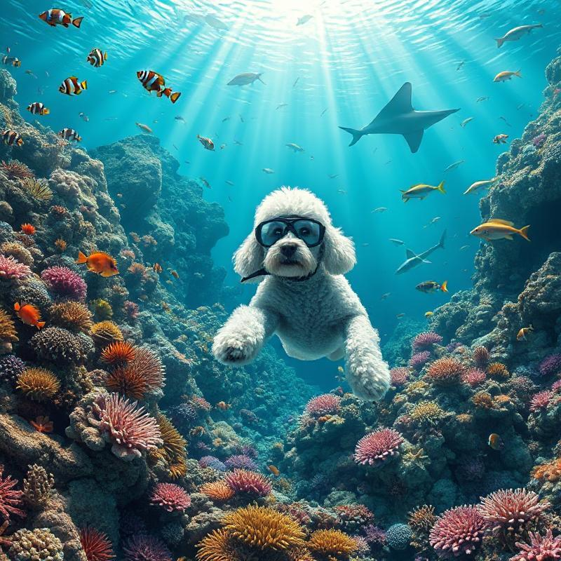{width=600px}](cassie-snorkle-11.jpg)<figcaption>cassie-snorkle-11.jpg Create a detailed image of an underwater world including corals, a multitude of sea creatures, and rocky outcrops and caves.  Include: Clownfish Parrotfish Butterflyfish Angelfish Moray Eel Sea Turtles Stingrays Sea Anemones Starfish Sea Urchins Lionfish Barracuda Surgeonfish Giant Clams Sea Cucumbers Octopus Reef Sharks Manta Rays Seahorses and Coral Polyps.  In the foreground is a white Spoodle dog wearing a mask and snorkle free diving mid-water. Rays of light penetrate the water. The image is in the style of a photograph, with incredible detail and a multitude of sea creatures swimming, floating and crawling...Flat AI.
</figcaption></figure>
<figure>[{width=600px}](cassie-snorkle-12.jpg)<figcaption>cassie-snorkle-12.jpg Create a detailed image of an underwater world including corals, a multitude of sea creatures, and rocky outcrops and caves.  Include: Clownfish Parrotfish Butterflyfish Angelfish Moray Eel Sea Turtles Stingrays Sea Anemones Starfish Sea Urchins Lionfish Barracuda Surgeonfish Giant Clams Sea Cucumbers Octopus Reef Sharks Manta Rays Seahorses and Coral Polyps.  In the foreground is a white Spoodle dog wearing a mask and snorkle free diving mid-water. Rays of light penetrate the water. The image is in the style of a photograph, with incredible detail and a multitude of sea creatures swimming, floating and crawling...Artguru.
</figcaption></figure>
<figure>[{width=600px}](cassie-snorkle-13.jpg)<figcaption>cassie-snorkle-13.jpg Create a detailed image of an underwater world including corals, a multitude of sea creatures, and rocky outcrops and caves.  Include: Clownfish Parrotfish Butterflyfish Angelfish Moray Eel Sea Turtles Stingrays Sea Anemones Starfish Sea Urchins Lionfish Barracuda Surgeonfish Giant Clams Sea Cucumbers Octopus Reef Sharks Manta Rays Seahorses and Coral Polyps.  In the foreground is a white Spoodle dog wearing a mask and snorkle free diving mid-water. Rays of light penetrate the water. The image is in the style of a photograph, with incredible detail and a multitude of sea creatures swimming, floating and crawling...Artguru.
</figcaption></figure>
<figure>[{width=600px}](cassie-snorkle-14.jpg)<figcaption>cassie-snorkle-14.jpg Create a detailed image of an underwater world including corals, a multitude of sea creatures, and rocky outcrops and caves.  Include: Clownfish Parrotfish Butterflyfish Angelfish Moray Eel Sea Turtles Stingrays Sea Anemones Starfish Sea Urchins Lionfish Barracuda Surgeonfish Giant Clams Sea Cucumbers Octopus Reef Sharks Manta Rays Seahorses and Coral Polyps.  In the foreground is a white Spoodle dog wearing a mask and snorkle free diving mid-water. Rays of light penetrate the water. The image is in the style of a photograph, with incredible detail and a multitude of sea creatures swimming, floating and crawling...Perchance
</figcaption></figure>
<figure>[{width=600px}](cassie-snorkle-15.jpg)<figcaption>cassie-snorkle-15.jpg Create a detailed image of an underwater world including corals, a multitude of sea creatures, and rocky outcrops and caves.  Include: Clownfish Parrotfish Butterflyfish Angelfish Moray Eel Sea Turtles Stingrays Sea Anemones Starfish Sea Urchins Lionfish Barracuda Surgeonfish Giant Clams Sea Cucumbers Octopus Reef Sharks Manta Rays Seahorses and Coral Polyps.  In the foreground is a white Spoodle dog wearing a mask and snorkle free diving mid-water. Rays of light penetrate the water. The image is in the style of a photograph, with incredible detail and a multitude of sea creatures swimming, floating and crawling...Perchance
</figcaption></figure>
<figure>[{width=600px}](cassie-snorkle-16.jpg)<figcaption>cassie-snorkle-16.jpg Create a detailed image of an underwater world including corals, a multitude of sea creatures, and rocky outcrops and caves.  Include: Clownfish Parrotfish Butterflyfish Angelfish Moray Eel Sea Turtles Stingrays Sea Anemones Starfish Sea Urchins Lionfish Barracuda Surgeonfish Giant Clams Sea Cucumbers Octopus Reef Sharks Manta Rays Seahorses and Coral Polyps.  In the foreground is a white Spoodle dog wearing a mask and snorkle free diving mid-water. Rays of light penetrate the water. The image is in the style of a photograph, with incredible detail and a multitude of sea creatures swimming, floating and crawling...Perchance
</figcaption></figure>
<figure>[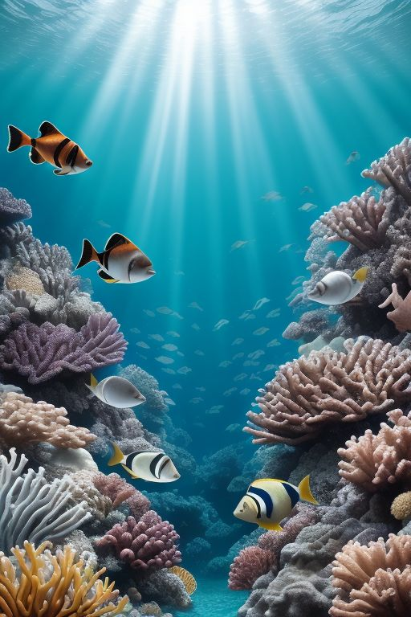{width=600px}](cassie-snorkle-17.jpg)<figcaption>cassie-snorkle-17.jpg Create a detailed image of an underwater world including corals, a multitude of sea creatures, and rocky outcrops and caves.  Include: Clownfish Parrotfish Butterflyfish Angelfish Moray Eel Sea Turtles Stingrays Sea Anemones Starfish Sea Urchins Lionfish Barracuda Surgeonfish Giant Clams Sea Cucumbers Octopus Reef Sharks Manta Rays Seahorses and Coral Polyps.  In the foreground is a white Spoodle dog wearing a mask and snorkle free diving mid-water. Rays of light penetrate the water. The image is in the style of a photograph, with incredible detail and a multitude of sea creatures swimming, floating and crawling...Perchance
</figcaption></figure>
<figure>[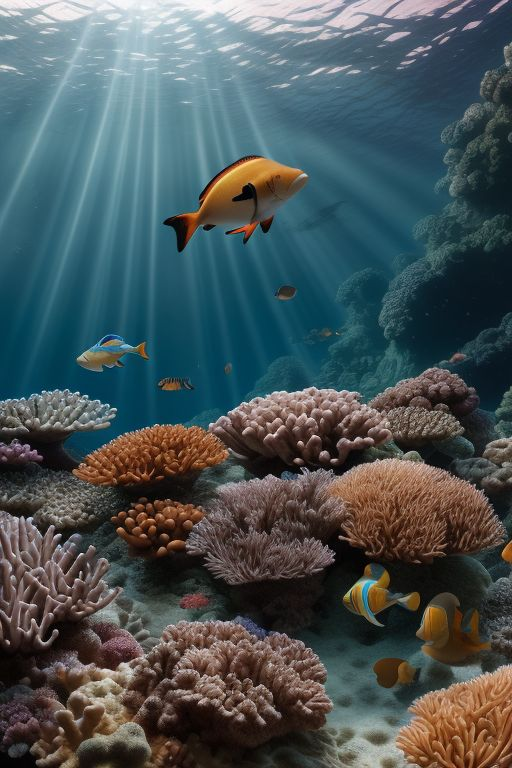{width=600px}](cassie-snorkle-18.jpg)<figcaption>cassie-snorkle-18.jpg Create a detailed image of an underwater world including corals, a multitude of sea creatures, and rocky outcrops and caves.  Include: Clownfish Parrotfish Butterflyfish Angelfish Moray Eel Sea Turtles Stingrays Sea Anemones Starfish Sea Urchins Lionfish Barracuda Surgeonfish Giant Clams Sea Cucumbers Octopus Reef Sharks Manta Rays Seahorses and Coral Polyps.  In the foreground is a white Spoodle dog wearing a mask and snorkle free diving mid-water. Rays of light penetrate the water. The image is in the style of a photograph, with incredible detail and a multitude of sea creatures swimming, floating and crawling...Perchance
</figcaption></figure>
<figure>[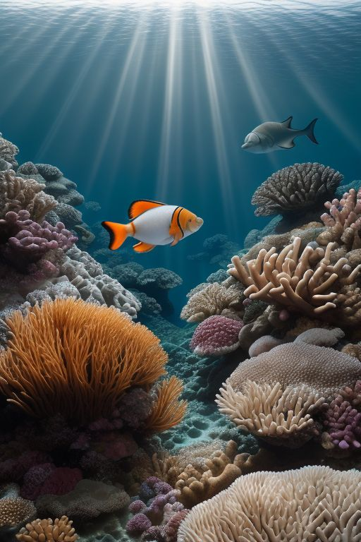{width=600px}](cassie-snorkle-19.jpg)<figcaption>cassie-snorkle-19.jpg Create a detailed image of an underwater world including corals, a multitude of sea creatures, and rocky outcrops and caves.  Include: Clownfish Parrotfish Butterflyfish Angelfish Moray Eel Sea Turtles Stingrays Sea Anemones Starfish Sea Urchins Lionfish Barracuda Surgeonfish Giant Clams Sea Cucumbers Octopus Reef Sharks Manta Rays Seahorses and Coral Polyps.  In the foreground is a white Spoodle dog wearing a mask and snorkle free diving mid-water. Rays of light penetrate the water. The image is in the style of a photograph, with incredible detail and a multitude of sea creatures swimming, floating and crawling...Perchance
</figcaption></figure>
<figure>[{width=600px}](cassie-snorkle-20.jpg)<figcaption>cassie-snorkle-20.jpg Create a detailed image of an underwater world including corals, a multitude of sea creatures, and rocky outcrops and caves.  Include: Clownfish Parrotfish Butterflyfish Angelfish Moray Eel Sea Turtles Stingrays Sea Anemones Starfish Sea Urchins Lionfish Barracuda Surgeonfish Giant Clams Sea Cucumbers Octopus Reef Sharks Manta Rays Seahorses and Coral Polyps.  In the foreground is a white Spoodle dog wearing a mask and snorkle free diving mid-water. Rays of light penetrate the water. The image is in the style of a photograph, with incredible detail and a multitude of sea creatures swimming, floating and crawling...pixlr.com.
</figcaption></figure>
<figure>[{width=600px}](cassie-snorkle-21.jpg)<figcaption>cassie-snorkle-21.jpg Create a detailed image of an underwater world including corals, a multitude of sea creatures, and rocky outcrops and caves.  Include: Clownfish Parrotfish Butterflyfish Angelfish Moray Eel Sea Turtles Stingrays Sea Anemones Starfish Sea Urchins Lionfish Barracuda Surgeonfish Giant Clams Sea Cucumbers Octopus Reef Sharks Manta Rays Seahorses and Coral Polyps.  In the foreground is a white Spoodle dog wearing a mask and snorkle free diving mid-water. Rays of light penetrate the water. The image is in the style of a photograph, with incredible detail and a multitude of sea creatures swimming, floating and crawling...pixlr.com.
</figcaption></figure>
<figure>[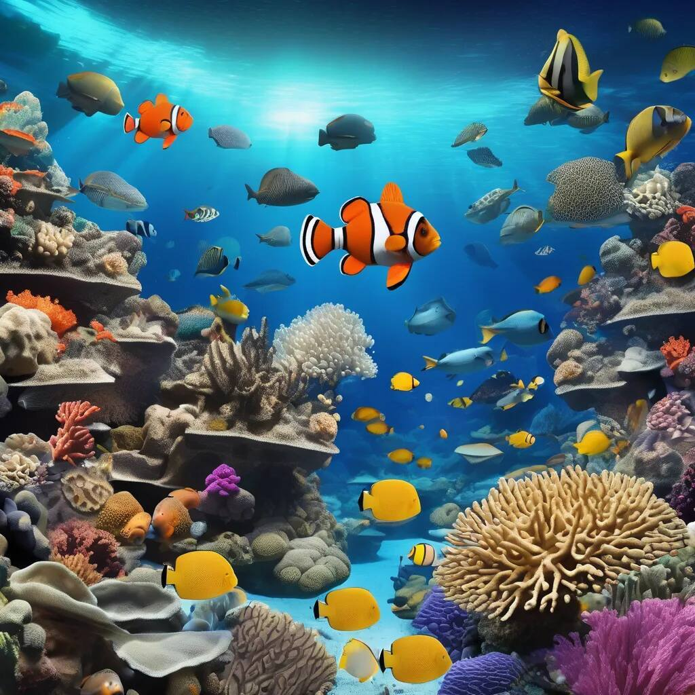{width=600px}](cassie-snorkle-22.jpg)<figcaption>cassie-snorkle-22.jpg Create a detailed image of an underwater world including corals, a multitude of sea creatures, and rocky outcrops and caves.  Include: Clownfish Parrotfish Butterflyfish Angelfish Moray Eel Sea Turtles Stingrays Sea Anemones Starfish Sea Urchins Lionfish Barracuda Surgeonfish Giant Clams Sea Cucumbers Octopus Reef Sharks Manta Rays Seahorses and Coral Polyps.  In the foreground is a white Spoodle dog wearing a mask and snorkle free diving mid-water. Rays of light penetrate the water. The image is in the style of a photograph, with incredible detail and a multitude of sea creatures swimming, floating and crawling...pixlr.com.
</figcaption></figure>
<figure>[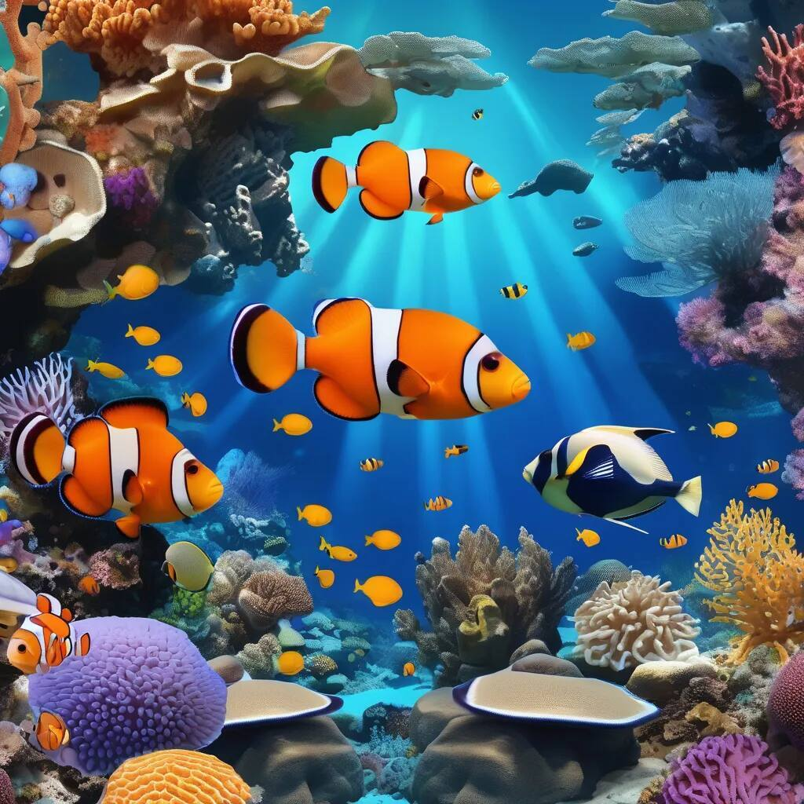{width=600px}](cassie-snorkle-23.jpg)<figcaption>cassie-snorkle-23.jpg Create a detailed image of an underwater world including corals, a multitude of sea creatures, and rocky outcrops and caves.  Include: Clownfish Parrotfish Butterflyfish Angelfish Moray Eel Sea Turtles Stingrays Sea Anemones Starfish Sea Urchins Lionfish Barracuda Surgeonfish Giant Clams Sea Cucumbers Octopus Reef Sharks Manta Rays Seahorses and Coral Polyps.  In the foreground is a white Spoodle dog wearing a mask and snorkle free diving mid-water. Rays of light penetrate the water. The image is in the style of a photograph, with incredible detail and a multitude of sea creatures swimming, floating and crawling...pixlr.com.
</figcaption></figure>
<figure>[{width=600px}](cassie-snorkle-24.jpg)<figcaption>cassie-snorkle-24.jpg Create a detailed image of an underwater world including corals, a multitude of sea creatures, and rocky outcrops and caves.  Include: Clownfish Parrotfish Butterflyfish Angelfish Moray Eel Sea Turtles Stingrays Sea Anemones Starfish Sea Urchins Lionfish Barracuda Surgeonfish Giant Clams Sea Cucumbers Octopus Reef Sharks Manta Rays Seahorses and Coral Polyps.  In the foreground is a white Spoodle dog wearing a mask and snorkle free diving mid-water. Rays of light penetrate the water. The image is in the style of a photograph, with incredible detail and a multitude of sea creatures swimming, floating and crawling...Bylo.ai.
</figcaption></figure>
<figure>[{width=600px}](cassie-snorkle-25.jpg)<figcaption>cassie-snorkle-25.jpg Create a detailed image of an underwater world including corals, a multitude of sea creatures, and rocky outcrops and caves.  Include: Clownfish Parrotfish Butterflyfish Angelfish Moray Eel Sea Turtles Stingrays Sea Anemones Starfish Sea Urchins Lionfish Barracuda Surgeonfish Giant Clams Sea Cucumbers Octopus Reef Sharks Manta Rays Seahorses and Coral Polyps.  In the foreground is a white Spoodle dog wearing a mask and snorkle free diving mid-water. Rays of light penetrate the water. The image is in the style of a photograph, with incredible detail and a multitude of sea creatures swimming, floating and crawling...Ideogram.
</figcaption></figure>
<figure>[{width=600px}](cassie-snorkle-26.jpg)<figcaption>cassie-snorkle-26.jpg Create a detailed image of an underwater world including corals, a multitude of sea creatures, and rocky outcrops and caves.  Include: Clownfish Parrotfish Butterflyfish Angelfish Moray Eel Sea Turtles Stingrays Sea Anemones Starfish Sea Urchins Lionfish Barracuda Surgeonfish Giant Clams Sea Cucumbers Octopus Reef Sharks Manta Rays Seahorses and Coral Polyps.  In the foreground is a white Spoodle dog wearing a mask and snorkle free diving mid-water. Rays of light penetrate the water. The image is in the style of a photograph, with incredible detail and a multitude of sea creatures swimming, floating and crawling...Ideogram.
</figcaption></figure>
<figure>[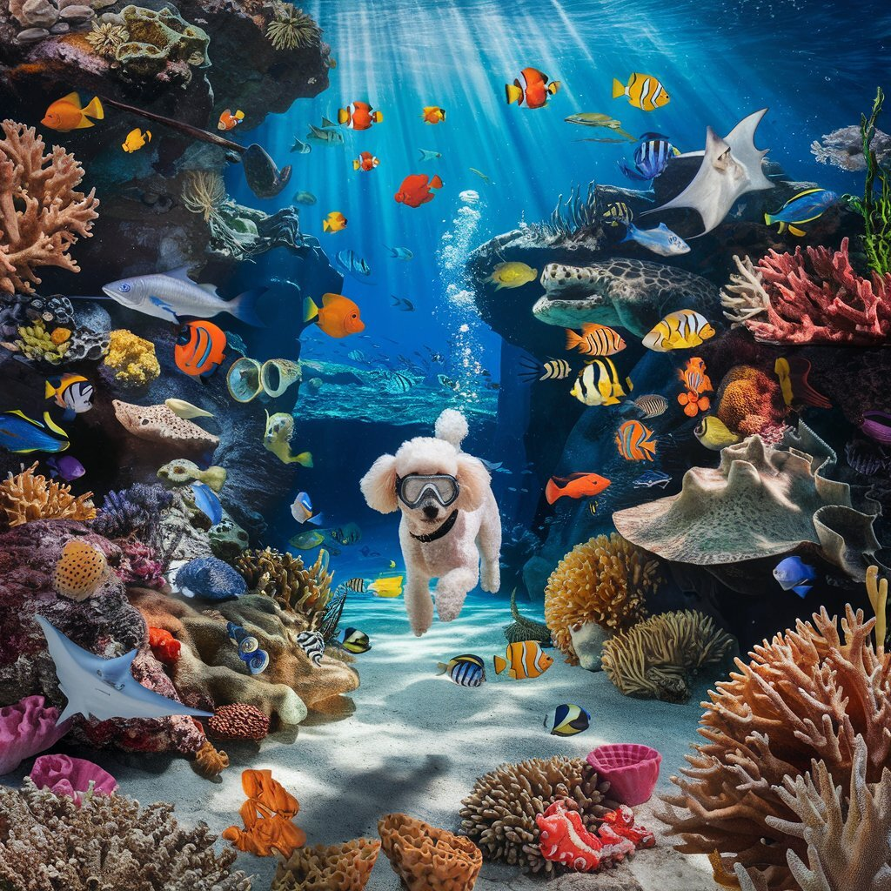{width=600px}](cassie-snorkle-27.jpg)<figcaption>cassie-snorkle-27.jpg Create a detailed image of an underwater world including corals, a multitude of sea creatures, and rocky outcrops and caves.  Include: Clownfish Parrotfish Butterflyfish Angelfish Moray Eel Sea Turtles Stingrays Sea Anemones Starfish Sea Urchins Lionfish Barracuda Surgeonfish Giant Clams Sea Cucumbers Octopus Reef Sharks Manta Rays Seahorses and Coral Polyps.  In the foreground is a white Spoodle dog wearing a mask and snorkle free diving mid-water. Rays of light penetrate the water. The image is in the style of a photograph, with incredible detail and a multitude of sea creatures swimming, floating and crawling...Ideogram.
</figcaption></figure>
<figure>[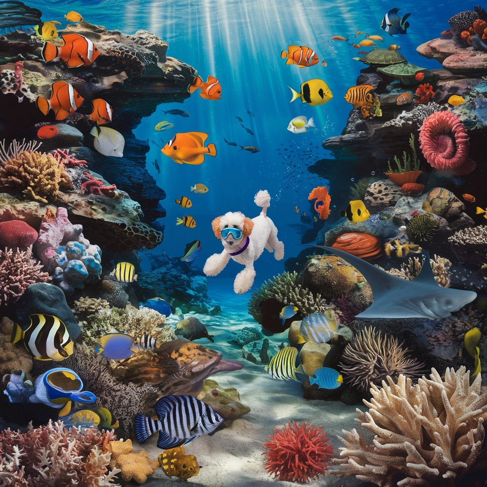{width=600px}](cassie-snorkle-28.jpg)<figcaption>cassie-snorkle-28.jpg Create a detailed image of an underwater world including corals, a multitude of sea creatures, and rocky outcrops and caves.  Include: Clownfish Parrotfish Butterflyfish Angelfish Moray Eel Sea Turtles Stingrays Sea Anemones Starfish Sea Urchins Lionfish Barracuda Surgeonfish Giant Clams Sea Cucumbers Octopus Reef Sharks Manta Rays Seahorses and Coral Polyps.  In the foreground is a white Spoodle dog wearing a mask and snorkle free diving mid-water. Rays of light penetrate the water. The image is in the style of a photograph, with incredible detail and a multitude of sea creatures swimming, floating and crawling...Ideogram.
</figcaption></figure>
<figure>[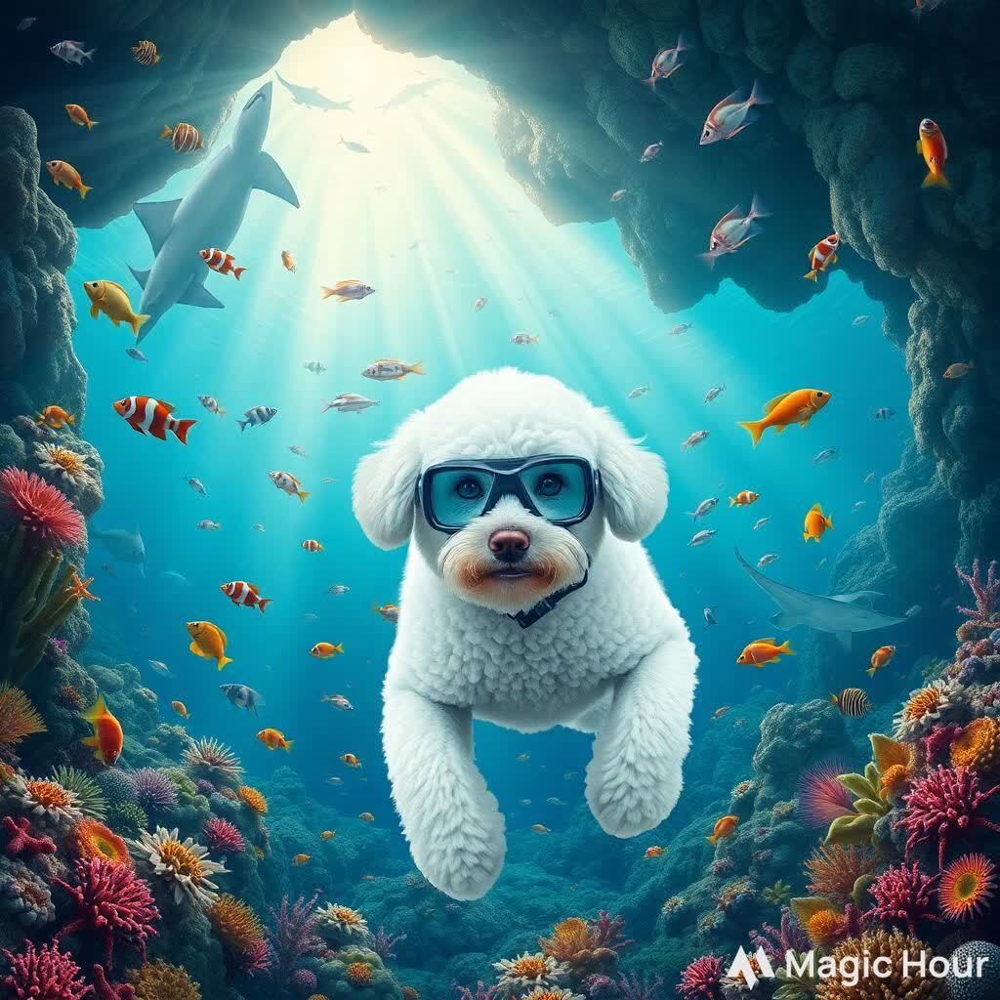{width=600px}](cassie-snorkle-29.jpg)<figcaption>cassie-snorkle-29.jpg Create a detailed image of an underwater world including corals, a multitude of sea creatures, and rocky outcrops and caves.  Include: Clownfish Parrotfish Butterflyfish Angelfish Moray Eel Sea Turtles Stingrays Sea Anemones Starfish Sea Urchins Lionfish Barracuda Surgeonfish Giant Clams Sea Cucumbers Octopus Reef Sharks Manta Rays Seahorses and Coral Polyps.  In the foreground is a white Spoodle dog wearing a mask and snorkle free diving mid-water. Rays of light penetrate the water. The image is in the style of a photograph, with incredible detail and a multitude of sea creatures swimming, floating and crawling...MagicHour.
</figcaption></figure>
<figure>[{width=600px}](cassie-snorkle-30.jpg)<figcaption>cassie-snorkle-30.jpg Create a detailed image of an underwater world including corals, a multitude of sea creatures, and rocky outcrops and caves.  Include: Clownfish Parrotfish Butterflyfish Angelfish Moray Eel Sea Turtles Stingrays Sea Anemones Starfish Sea Urchins Lionfish Barracuda Surgeonfish Giant Clams Sea Cucumbers Octopus Reef Sharks Manta Rays Seahorses and Coral Polyps.  In the foreground is a white Spoodle dog wearing a mask and snorkle free diving mid-water. Rays of light penetrate the water. The image is in the style of a photograph, with incredible detail and a multitude of sea creatures swimming, floating and crawling...MagicHour.
</figcaption></figure>
<figure>[{width=600px}](cassie-snorkle-31.jpg)<figcaption>cassie-snorkle-31.jpg Create a detailed image of an underwater world including corals, a multitude of sea creatures, and rocky outcrops and caves.  Include: Clownfish Parrotfish Butterflyfish Angelfish Moray Eel Sea Turtles Stingrays Sea Anemones Starfish Sea Urchins Lionfish Barracuda Surgeonfish Giant Clams Sea Cucumbers Octopus Reef Sharks Manta Rays Seahorses and Coral Polyps.  In the foreground is a white Spoodle dog wearing a mask and snorkle free diving mid-water. Rays of light penetrate the water. The image is in the style of a photograph, with incredible detail and a multitude of sea creatures swimming, floating and crawling...Dezgo.
</figcaption></figure>
:::
:::{#prompt}
:::

