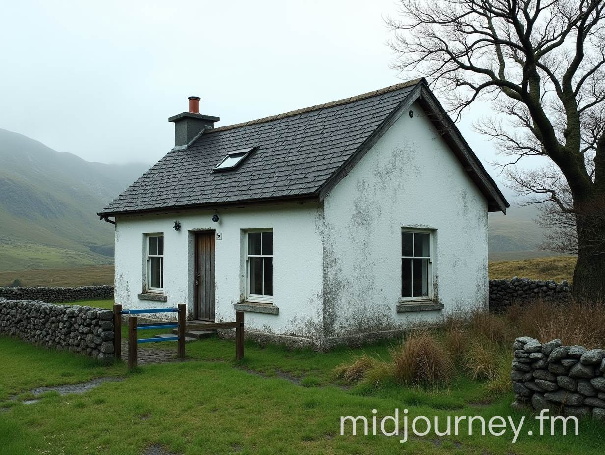
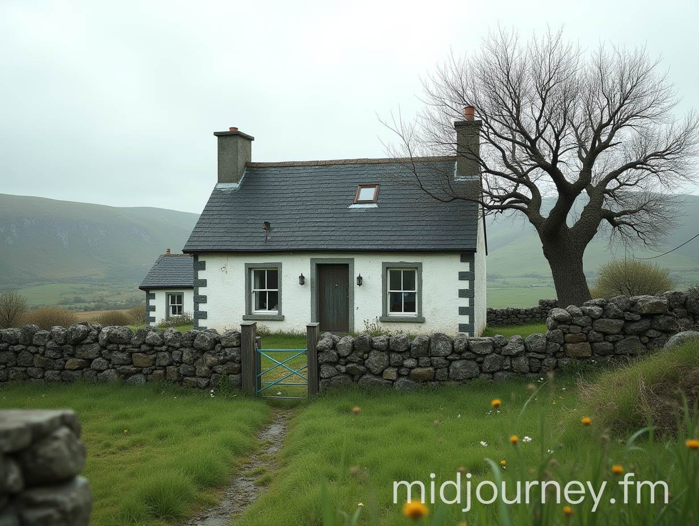

:::#images
<figure>[{width=600px}](kanes-house-2.jpg)<figcaption>kanes-house-2.jpg</figcaption></figure>
<figure>[{width=600px}](kanes-house-3.jpg)<figcaption>kanes-house-3.jpg</figcaption></figure>
<figure>[{width=600px}](kanes-house-4.jpg)<figcaption>kanes-house-4.jpg</figcaption></figure>
<figure>[{width=600px}](kanes-house-5.jpg)<figcaption>kanes-house-5.jpg</figcaption></figure>
<figure>[{width=600px}](kanes-house-6.jpg)<figcaption>kanes-house-6.jpg</figcaption></figure>
<figure>[{width=600px}](kanes-house-chatgpt-prompt.jpg)<figcaption>kanes-house-chatgpt-prompt.jpg</figcaption></figure>
<figure>[{width=600px}](kanes-house.jpg)<figcaption>kanes-house.jpg</figcaption></figure>
:::
:::#prompt
:::

