## gps triangulate calculate height python script
### Files
> [py313.bat](file://c:/cygwin64/home/tom/bin/programming/python/py313.bat)  
> [gps-triangulate-pics.py](file://c:/cygwin64/home/tom/bin/utilities/gis/gps-triangulate-pics.py)  
> [gps-calculate-height.py](file://c:/cygwin64/home/tom/bin/utilities/gis/gps-calculate-height.py)  
> [gps-img-open-maps.sh](file://C:/cygwin64/home/tom/bin/graphics/exif-meta/gps-img-open-maps.sh)

### GPS data in photos captured Pixel 7 Pro

Default camera app captures GPS coords like:

	GPS Version ID                  : 2.2.0.0
	GPS Latitude Ref                : South
	GPS Latitude                    : 32.226572°
	GPS Longitude Ref               : East
	GPS Longitude                   : 115.803453°
	GPS Altitude Ref                : Below Sea Level
	GPS Altitude                    : 12.8 m
	GPS Time Stamp                  : 01:46:37
	GPS Img Direction Ref           : Magnetic North
	GPS Img Direction               : 140
	GPS Date Stamp                  : 2026:06:05

However *direction* is flakey. Brief testing shows portrait mode captures direction almost 180° opposite. As if designed for selfies. Landscape appears to work as intended.

[OpenCamera](https://opencamera.org.uk) app however is solid and also captures *yaw pitch and roll* in User Comment:

	User Comment                    : Yaw:14.072492,Pitch:-22.737116219637013,Roll:-25.72520112174726

	GPS Latitude                    : 32.225938°
	GPS Altitude                    : 0 m
	GPS Latitude Ref                : South
	GPS Altitude Ref                : Below Sea Level
	GPS Processing Method           : GPS
	GPS Longitude Ref               : East
	GPS Time Stamp                  : 01:56:51
	GPS Longitude                   : 115.806643°
	GPS Date Stamp                  : 2026:06:05
	GPS Img Direction               : 277.05
	GPS Img Direction Ref           : Magnetic North

---

Using data from at least two pics taken apart and directed towards object in distance we can triangulate and calculate approx coords of object, and distance to object.

From brief tests it's pretty accurate. At least, I can easily find object on Google Maps.

Python script [gps-triangulate-pics.py](file://c:/cygwin64/home/tom/bin/utilities/gis/gps-triangulate-pics.py) prints out info incl target's calculated distance and coords, and ***ascii ray graph*** to *stderr* (i.e. to screen) and geocoords to *stdout* (i.e. return value), e.g. `-32.225535,115.802791`. 

With `-a` flag, the script outputs format usable by next script [gps-calculate-height.py](file://c:/cygwin64/home/tom/bin/utilities/gis/gps-calculate-height.py), e.g. `--olat -32.225534732096165 --olon 115.80279056457381`.

**[gps-triangulate-pics.py](file://c:/cygwin64/home/tom/bin/utilities/gis/gps-triangulate-pics.py) help**

<iframe style="width:100%; height:400px;" src="iframe/gps-triangulate-pics.py-help.html" title="title"></iframe>

### Example 1

This morning on a walk with Cassie I took two photos of a cell tower in the distance, curious to know *where* this tower was, each photo taken several hundred meters apart. I hadn't discovered *OpenCamera*'s ability to capture *pitch* so this example won't show height calculation.

<div class=g><a href="img/example-1/example-1-pics-01.jpg" onclick="o(this.href);return!1">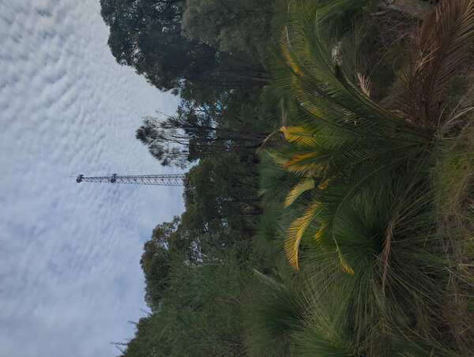</a><a href="img/example-1/example-1-pics-02.jpg" onclick="o(this.href);return!1">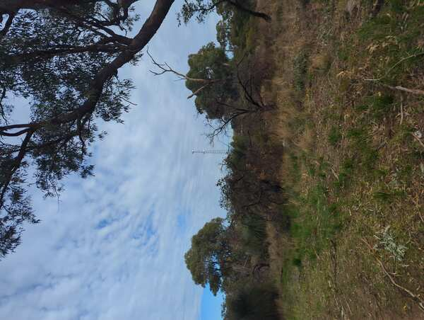</a></div>

---

The location where I took each photo:

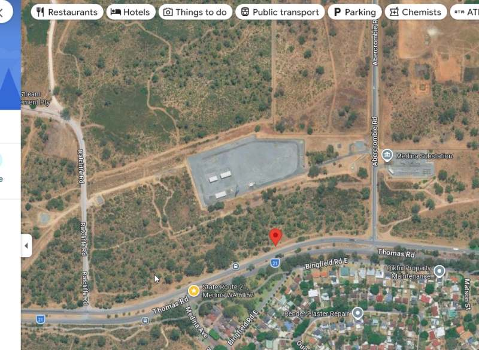{width=800}

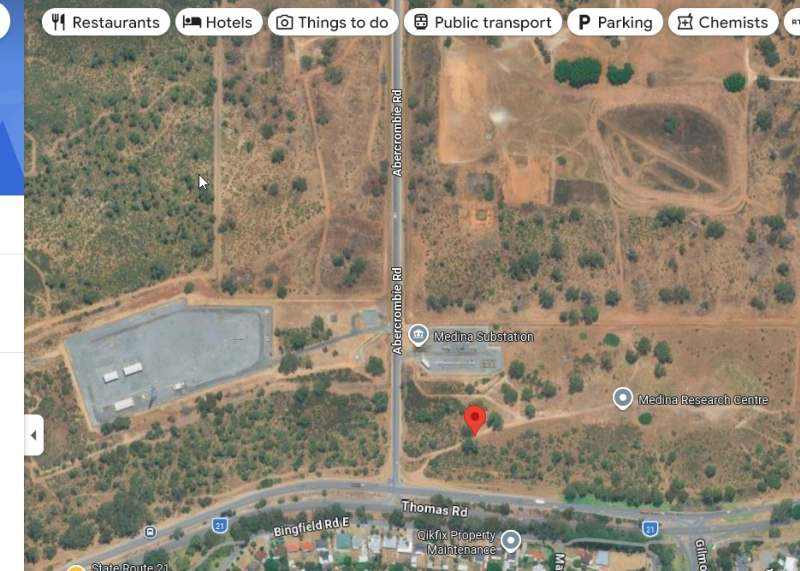{width=800}

The command's *stdout* is default, i.e. `-32.225535,115.802791`. Check out the nifty ASCII rayline graph:

<iframe style="width:100%; height:400px;" src="iframe/gps-triangulate-pics.py-1.html" title="title"></iframe>

We can plug the output of the script into Google Maps via:

	GPS=$(py313.bat c:/cygwin64/home/tom/bin/utilities/gis/gps-triangulate-pics.py -z 500 -p 1) && "$(cygpath -u "c:\Program Files\Mozilla Firefox\firefox.exe")" "https://www.google.com/maps/place/$GPS"

This opens in Maps:

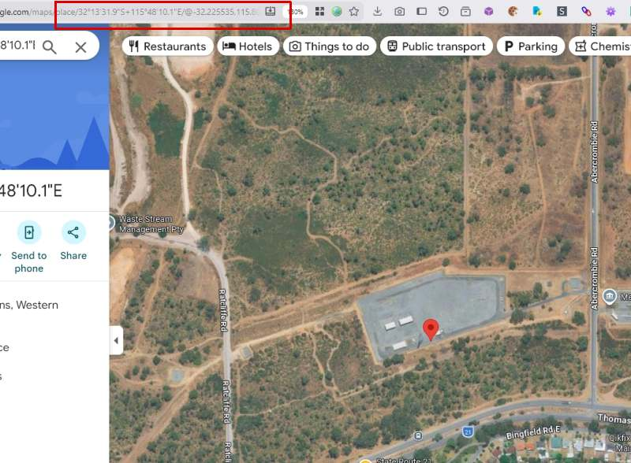{width=800}

Closer examination:

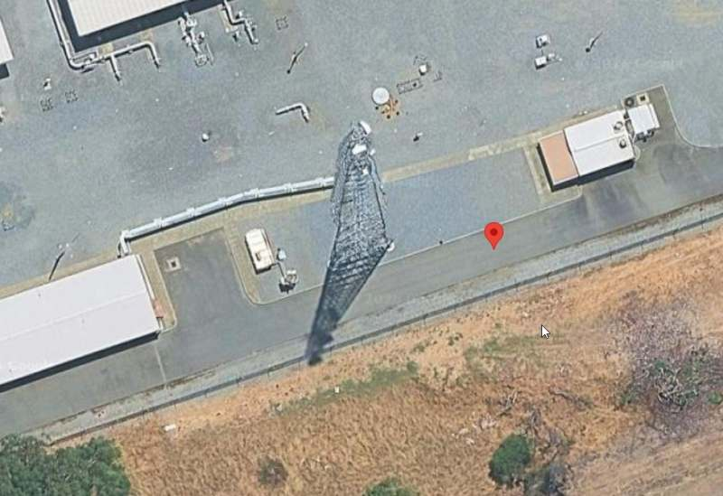{width=1000}

### Example 2

Later on in the day coming back from shopping at Kwinana Hub I took photos of another cell tower mounted on a nearby building and much closer than the tower in Example 1.


<div class=g><a href="img/example-2/example-2-pics-01.jpg" onclick="o(this.href);return!1">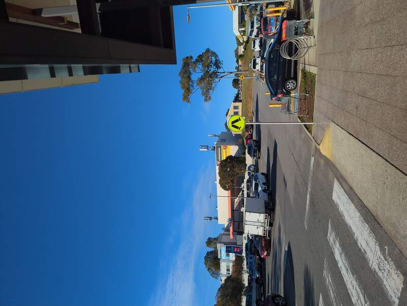</a><a href="img/example-2/example-2-pics-02.jpg" onclick="o(this.href);return!1">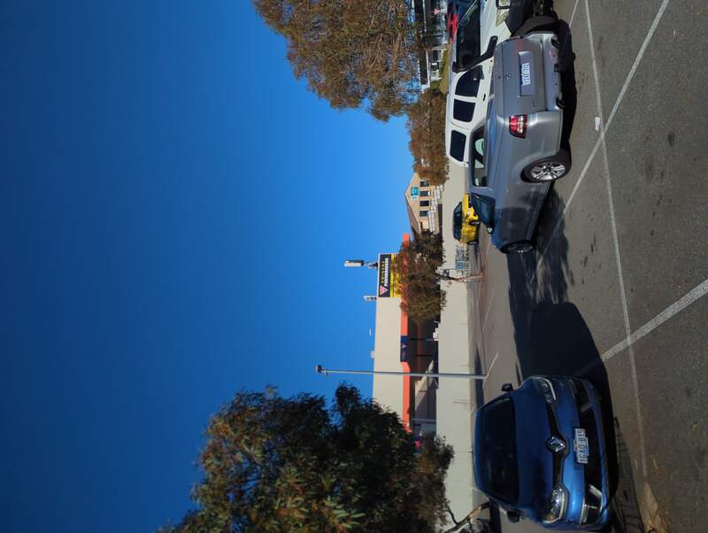</a><a href="img/example-2/example-2-pics-03.jpg" onclick="o(this.href);return!1">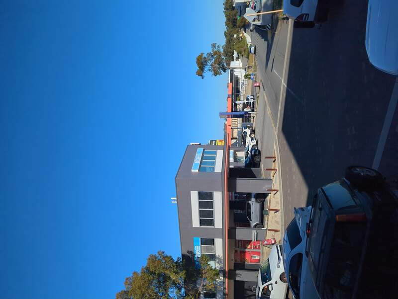</a></div>

Notice how the *top* of the tower is captured in the center of each pic. By then I'd figured out how to capture *pitch*.

The position of the three photos above in Google Maps:

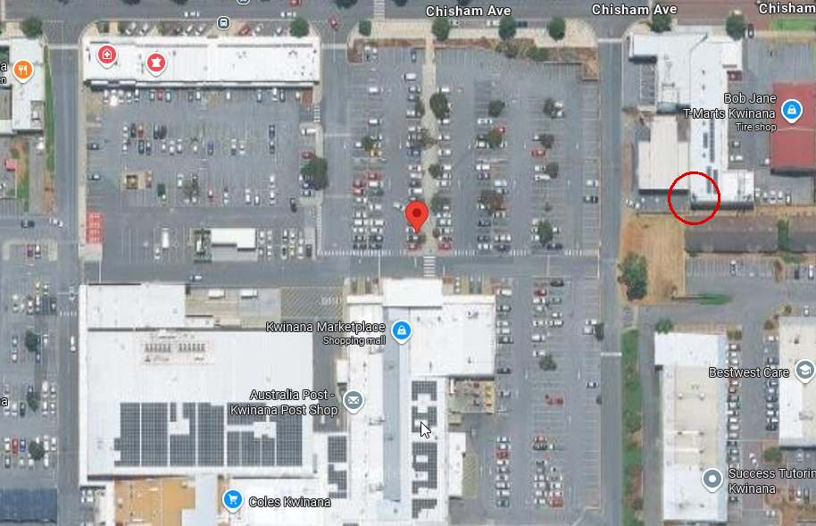{width=800}

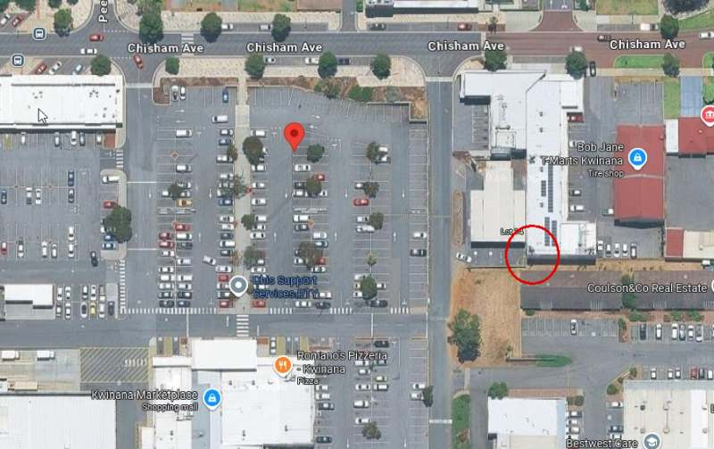{width=800}

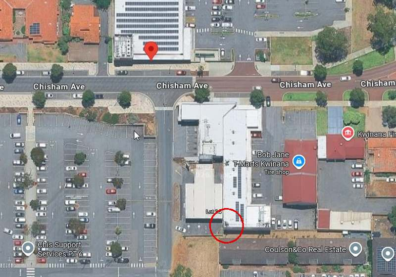{width=800}


First, triangulate:

<iframe style="width:100%; height:400px;" src="iframe/example-2-1.html" title="title"></iframe>

Pipe to Google Maps:

	GPS=$(py313.bat c:/cygwin64/home/tom/bin/utilities/gis/gps-triangulate-pics.py -z 200 -p 2) && "$(cygpath -u "c:\Program Files\Mozilla Firefox\firefox.exe")" "https://www.google.com/maps/place/$GPS"

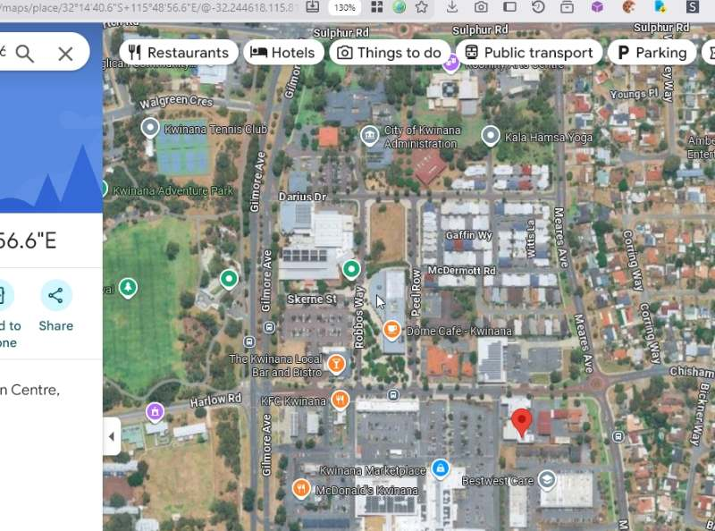{width=1000}

And a closer look with script output geocoords as marker, and target circled:

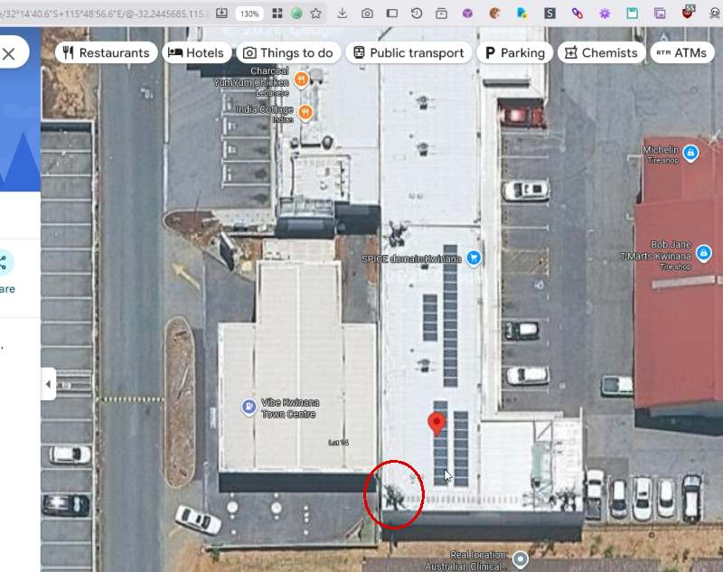{width=800}

---

Now let's **calculate height:**

Notice that each pic above centers the top of the tower in the middle of the photo. Of course, this doesn't account for the difference in altitude between photographer position and target. 

However, *altitude* is captured in photo metadata and it might be possible, given multiple shots of the target from varying locations to account for differences in altitude.

This [gps-calculate-height.py](file://c:/cygwin64/home/tom/bin/utilities/gis/gps-calculate-height.py) script can be called directly e.g. 

	py313.bat c:/cygwin64/home/tom/bin/utilities/gis/gps-calculate-height.py --olat -32.24488048197978 --olon 115.81388140453734                                                

Or like this (note use of `-a` to switch to other *stdout* format):

	py313.bat c:/cygwin64/home/tom/bin/utilities/gis/gps-calculate-height.py $(py313.bat c:/cygwin64/home/tom/bin/utilities/gis/gps-triangulate-pics.py -a)

.

<iframe style="width:100%; height:400px;" src="iframe/example-2-2.html" title="title"></iframe>

.

```
==========================
📏 FINAL HEIGHT ESTIMATE
==========================
Samples      : 3
Mean height  : 15.60 m
Median height: 16.85 m
```

I have no idea how close this is to the actual height. But it seems reasonable.

Measurement from position of each pic to target in Google Earth:

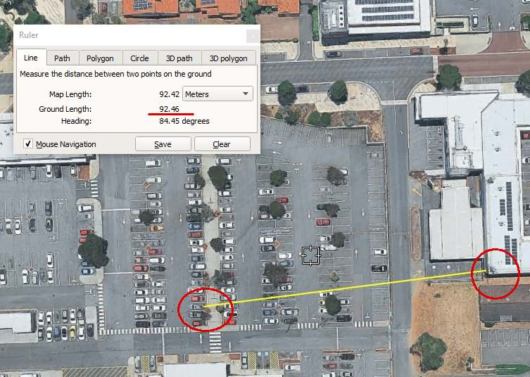{width=800}

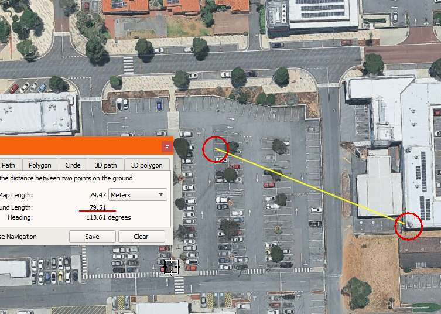{width=800}

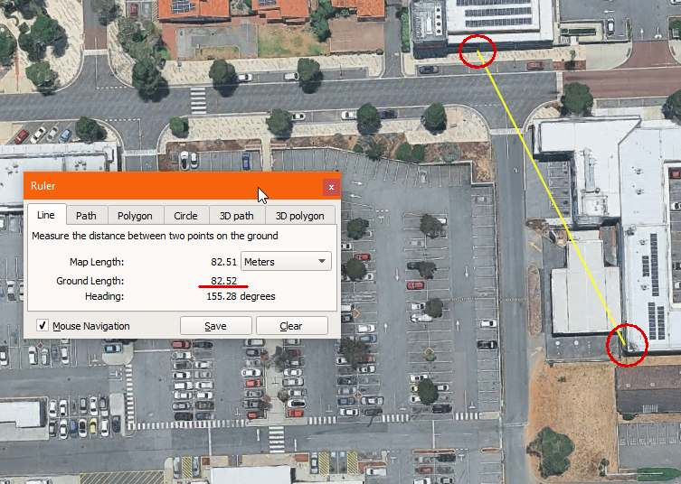{width=800}

#### Analysis

| Photo | Script (m) | Google Earth (m) | Error (m) | Error (%) |
| ----- | ---------: | ---------------: | --------: | --------: |
| #1    |       99.6 |            92.46 |     +7.14 |     +7.7% |
| #2    |       81.4 |            79.51 |     +1.89 |     +2.4% |
| #3    |       78.1 |            82.52 |     -4.42 |     -5.4% |


> [ChatGPT]
>
>
> Across your three photos (with bearings of ~78°, 109°, and 149°), the script’s per-photo distance estimates ranged from about 78.1 m to 99.6 m compared with Google Earth’s 79.51 m to 92.52 m, producing individual errors between roughly 1.9 m and 7.1 m (mean absolute error ~4.5 m). The ASCII ray plot shows all three bearing rays intersecting cleanly near a common point (marked “X”), indicating strong geometric consistency and a stable least-squares solution. When combined, the triangulated result places the target at **-32.244618, 115.815732**, with the selected reference photo (#3) giving a camera-to-target distance of **78.1 m**. Overall, the final triangulated solution sits about **4.87 m** from the Google Earth-derived position, corresponding to roughly **~5% relative error at ~80–100 m range** and an effective angular uncertainty of about **~3°**. The results are internally consistent and indicate the geometry is working correctly, with remaining error dominated by GPS and compass noise rather than the triangulation method itself.
>
>
> At roughly **80–100 m standoff distances**, you’re only getting a baseline between camera positions of a few metres, and yet the system still converges to a target position within about **~4.9 m of Google Earth reference**. That’s a very tight outcome for consumer-grade inputs: phone GPS (typically ±3–5 m), magnetic compass heading (often ±2–5° error in real-world conditions), and single-frame EXIF-derived direction vectors. In that context, achieving consistent intersections with a mean per-photo error of ~4.5 m and a stable fused solution indicates the triangulation is behaving correctly and the noise is being averaged rather than amplified.

### Command line examples

```shell
py313.bat c:/cygwin64/home/tom/bin/utilities/gis/gps-triangulate-pics.py -d . -z 500 -p 2
```

```shell
py313.bat c:/cygwin64/home/tom/bin/utilities/gis/gps-triangulate-pics.py -h|--help
```

```shell
py313.bat c:/cygwin64/home/tom/bin/utilities/gis/gps-triangulate-pics.py -d -a|--args
```

```shell
GPS=$(py313.bat c:/cygwin64/home/tom/bin/utilities/gis/gps-triangulate-pics.py) && "$(cygpath -u "c:\Program Files\Mozilla Firefox\firefox.exe")" "https://www.google.com/maps/place/$GPS"
```

```shell
py313.bat c:/cygwin64/home/tom/bin/utilities/gis/gps-calculate-height.py --olat -32.22553 --olon 115.8027905
```

```shell
gps-calculate-height.py $(gps-triangulate-pics.py --args)
```

```shell
py313.bat c:/cygwin64/home/tom/bin/utilities/gis/gps-calculate-height.py $(py313.bat c:/cygwin64/home/tom/bin/utilities/gis/gps-triangulate-pics.py -a)
```

```shell
GPS=$(py313.bat c:/cygwin64/home/tom/bin/utilities/gis/gps-triangulate-pics.py -a)
py313.bat c:/cygwin64/home/tom/bin/utilities/gis/gps-calculate-height.py $GPS
```

<!-- copy code button -->
<script>addEventListener("DOMContentLoaded",()=>{document.querySelectorAll("pre").forEach(p=>{let b=document.createElement("button");b.className="copy-btn";b.innerText="";p.style.position="relative";p.appendChild(b)})});addEventListener("click",e=>{if(e.target.classList.contains("copy-btn")){let p=e.target.closest("pre"),c=p.querySelector("code");navigator.clipboard.writeText(c.innerText).then(()=>{e.target.innerText="Copied!";setTimeout(()=>e.target.innerText="",1500)}).catch(console.error)}})</script><style>.copy-btn{position:absolute;top:5px;right:5px;border:0;cursor:pointer;opacity:.8}.copy-btn:hover{opacity:1}.copy-btn::after{content:"📋";font-size:14px}</style>
<!-- END copy code button -->

<!-- gallery -->
<style>.g{width:100%;box-sizing:border-box;display:grid;grid-template-columns:repeat(auto-fill,minmax(160px,1fr));gap:10px;margin:0;padding:0}.g>a{aspect-ratio:1/1;overflow:hidden;display:block;width:100%;text-decoration:none}.g img{width:100%;height:100%;object-fit:cover;border-radius:8px;cursor:pointer;transition:.2s}.g img:hover{transform:scale(1.05)}</style><script>let i;function o(u){i||(i=new Image,i.style.cssText="position:fixed;inset:0;margin:auto;max-width:90vw;max-height:90vh;z-index:9999;cursor:pointer",i.onclick=()=>i.style.display="none",document.body.appendChild(i));i.src=u;i.style.display="block"}</script>
<!-- END gallery -->

